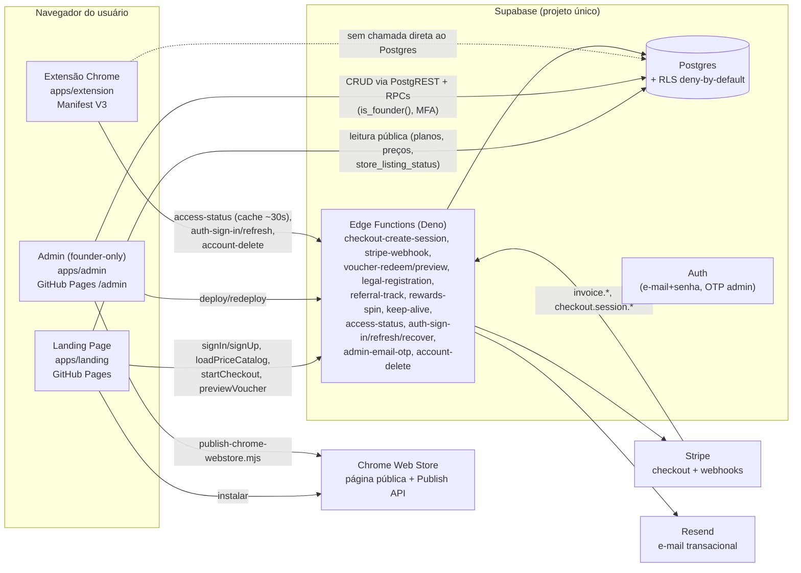

# Auditoria do ecossistema — QA Toolbar Sandbox

> Escrito em 2026-07-27 a partir de leitura direta do código (não do roadmap aspiracional).
> Reflete o estado real do repositório nesta data. Reescreva as seções que ficarem
> desatualizadas em vez de deixá-las como estavam — este documento só tem valor se continuar
> batendo com o código.

## 1. Visão geral

Três aplicações + um backend compartilhado, todos neste monorepo:

Não existe API própria fora das Edge Functions: a extensão e a landing conversam com o Supabase
via `@supabase/supabase-js` (PostgREST + RPC + Functions), nunca com um backend intermediário
próprio. O admin tem os mesmos três canais, mais acesso direto a tabelas administrativas via RLS
condicionada a `is_founder()`.

## 2. Responsabilidade de cada aplicação

### 2.1 Landing Page (`apps/landing`)

- **Stack**: React 19 + Vite + TypeScript, sem router (roteamento manual por `window.location.pathname`
  em `App.tsx`), publicada como site estático no GitHub Pages.
- **Finalidade**: apresentar o produto, planos/preços, cadastro/login, central de confiança
  (permissões/segurança), políticas legais, e entregar o handoff de sessão para a extensão.
- **Páginas reais hoje**: home (seções: Hero, Sobre, Semi-automático, Recursos, Planos, Campanha
  comunitária, Suporte), `/privacidade`, `/propriedade-intelectual`, `/redefinir-senha`,
  `/permissoes` e `/seguranca` (central de confiança, adicionada nesta auditoria — antes o
  conteúdo de permissões só existia dentro da política de privacidade).
- **i18n**: PT-BR, ES, EN completos e com garantia de tipo (`Dictionary` do TypeScript — uma
  chave faltando quebra o build, não é possível esquecer uma tradução silenciosamente).
- **Dados que trata**: e-mail/senha (via Supabase Auth), catálogo de preços (`stripe_prices`),
  status de assinatura (`access-status`), cupom/voucher em preview, status da Chrome Web Store.
  Não processa nem vê número de cartão (isso é 100% Stripe Checkout, hosted).
- **Riscos/limitações conhecidos**: preço/badge de desconto anual agora é calculado do catálogo
  real (corrigido nesta sessão); antes disso havia um texto de marketing fixo que podia divergir
  do valor cobrado de verdade.

### 2.2 Painel Administrativo (`apps/admin`)

- **Stack**: React 19 + Vite + TypeScript, GitHub Pages em `/admin`, sem self-signup público.
- **Finalidade**: operação do SaaS pelo founder — usuários, papéis, planos, feature flags,
  vouchers/campanhas, licenças offline, afiliados, QA Rewards (roleta de pontos), auditoria,
  jurídico (registro de marca/software), Dashboard de MRR/uso.
- **Autenticação**: senha + OTP por e-mail (MFA), token de reautenticação com janela de 60 min
  para ações sensíveis (`verify_admin_reauthentication_otp`), sem sessão de "usuário comum" —
  é founder-only.
- **Modelo de autorização**: RLS no Postgres com `is_founder()` como guarda central, mais um
  trigger genérico (`trg_audit_founder_mutation`) que audita toda mutação direta via PostgREST
  em uma lista fixa de tabelas administrativas — incluindo, desde esta sessão,
  `reward_programs`/`reward_prizes` (antes ficavam de fora por terem sido criadas depois do loop
  que anexa o trigger).
- **Dados que trata**: os mais sensíveis do ecossistema — papéis de usuário, e-mails, status de
  assinatura, motivos de suspensão, notas internas de suporte. Não deve expor (e não expõe, pelo
  código lido) senha, token completo, dados de cartão ou conteúdo de página.
- **Riscos corrigidos nesta sessão**: `schema.sql` (script de bootstrap de projeto novo) estava
  quebrado por um artefato de merge; campanhas de voucher tipo "desconto" nunca podiam ser
  criadas; ações críticas de rewards falhavam em silêncio; erros do Supabase apareciam como
  `[object Object]`; seis ações de revogação não tratavam falha; inputs de feature flag ficavam
  obsoletos após reload de outra aba. Todos corrigidos e cobertos pela suíte de testes.

### 2.3 Extensão Chrome (`apps/extension`)

- **Stack**: Manifest V3, JavaScript puro sem framework nem build step (script clássico +
  gêmeos `-content.js` para os módulos injetados como content script, já que content scripts
  clássicos não suportam `import`). `background/` é o service worker; `toolbar/` é a barra
  injetada na página (shadow DOM); `pagebridge/` roda no MAIN world da página (único lugar que
  enxerga `window.fetch`/`XMLHttpRequest` reais); `popup/` e `options/` são as páginas de
  extensão padrão do Chrome.
- **Permissões** (`manifest.json`): `storage`, `scripting`, `activeTab`, `tabs`, `contextMenus`,
  `alarms`, `host_permissions: <all_urls>`. O escopo de host é restringível pelo usuário nas
  Configurações (modo "todos os sites" / "customizado" / "somente ambientes configurados"), e a
  extensão de fato des-registra os content scripts fora do escopo — confirmado por leitura de
  `background.js` (`registerContentScripts`/`unregisterContentScripts`), não é só texto de
  marketing.
- **Ferramentas reais** (não aspiracionais — todas existem no código): workspaces (clientes/
  projetos/produtos/ambientes/URLs N:N), contas de teste, meios de pagamento sandbox, Auto preenchimento,
  Validador de campos, Macro Studio (record/replay + export Playwright), Key View, Network Inspector
  (agora com cURL completo: ver/copiar/executar, adicionado nesta sessão), captura de elementos
  (CSV com seletor/XPath), screenshots, gravação (vídeo e GIF), anotações (formas, setas, notas,
  borrão), Test Status (Pass/Fail/Limitation), Command History/Error Monitor, Breakpoint Viewer,
  Click Spy, Pixel Perfect, Freeze Clock, Force HTTP, JSON Studio, tutorial/tour contextual,
  **Sessão de Teste** (iniciar/durante/finalizar com resumo editável, agrupando status/evidência/
  erros HTTP do período) e **Report Builder** (bug/aprovação/limitação/impedimento/reteste/
  melhoria/risco, com templates pessoais e cópia formatada para Slack/Teams em mrkdwn) —
  as duas últimas adicionadas nesta sessão, schemaVersion do workspace em 17.
- **O que ainda não existe** (verificado por ausência no código, não suposição): Command
  Palette, integrações externas com OAuth real (Jira/Azure DevOps/GitHub — zero código de
  conector; Slack/Teams tem a fase 1 de "copiar formatado", não webhook/app), redação automática
  de dados sensíveis em evidências (existe para captura estruturada — macro/step recorder — mas
  não para o conteúdo de uma evidência de imagem/vídeo), analytics de funil/retenção de produto
  (ver `docs/analytics.md`).
- **Sincronização de plano**: `access-status` é chamado pela extensão com cache local de até
  ~30s (comentário em `FeatureFlagsPage.tsx` do admin confirma essa janela) — mudar uma feature
  flag no admin não reflete instantaneamente, mas em no máximo meio minuto.

## 3. Fluxos reais (verificados no código, não aspiracionais)

**Aquisição**: Landing (`/`) → clique em instalar → Chrome Web Store → instalação → primeira
abertura da extensão → popup com estado "deslogado" → clique em entrar redireciona para
`options.html?tab=account` (comportamento coberto pelo smoke: "Logged-out toolbar and Minha
conta login handoff").

**Cadastro/login**: Landing (modal de conta) ou `options.html` da extensão → Supabase Auth
(`auth-sign-in`/`auth-refresh` como Edge Functions, não chamada direta ao SDK de auth em todos os
pontos) → sessão persistida → `access-status` resolve plano/entitlements.

**Assinatura**: Landing → seleção de plano/ciclo → `checkout-create-session` → Stripe Checkout
(hosted, a landing nunca vê número de cartão) → `stripe-webhook` processa
`checkout.session.completed`/`invoice.payment_failed`/etc → grava em `subscriptions`/
`entitlement_grants` → `access-status` passa a refletir o novo plano para a extensão.

**Feature flag**: Admin (`FeatureFlagsPage.tsx`) → `setPlanFeatureValue` → tabela
`plan_features` → lida por `access-status` → extensão aplica em até ~30s (cache local).

**Voucher/campanha**: Admin cria voucher ou campanha de múltiplo resgate → `voucher-preview`
(landing, antes do checkout) → `voucher-redeem` (aplica desconto/dias/vitalício) → `credit_reward_points`
e o restante do fluxo de QA Rewards seguem a mesma tabela de auditoria.

**Exclusão de conta (LGPD)**: extensão (Minha conta → Excluir) → `account-delete` → cancela
assinatura Stripe ativa → apaga dados pessoais → anonimiza (não apaga) registros financeiros por
obrigação contábil.

**O que o PDF descreve mas não existe ainda**: fluxo de integração com OAuth real (Extensão →
Jira/Azure DevOps/GitHub → resposta → histórico) — ver `docs/integrations.md` para o porquê
(exige credencial de app registrado numa conta de terceiro que só o founder pode criar); fluxo de
suporte formal com ticket/categoria/prioridade — o admin tem notas internas por usuário, não um
sistema de ticket estruturado.

## 4. Matriz de consistência (recursos vs. onde aparecem)

| Recurso | Landing | Admin | Extensão | Fonte de verdade | Status |
|---|---|---|---|---|---|
| Planos (Smoke Test / Regression Runner / Root Cause Analyst / Release Manager) | Exibe preço/recursos | Gerencia (`PlansPage`, `FeatureFlagsPage`) | Consome via `access-status` | tabela `plans` + `plan_features` | Consistente — mesmos 4 planos nas 3 pontas |
| Preço mensal/anual | Lê `stripe_prices` via `loadPriceCatalog()` | Não edita preço aqui (Stripe é a fonte) | N/A | tabela `stripe_prices` (espelha Stripe) | Consistente desde a correção do badge "economize X%" nesta sessão |
| Permissões da extensão | Descritas em `/permissoes` e na política de privacidade | N/A | `manifest.json` real | `manifest.json` | Consistente — texto verificado contra o manifest real, sem divergência |
| Reward wheel / QA Rewards | Seção "Campanha comunitária" | `CampaignsPage` (kill switch, pesos, auditoria) | Não participa diretamente | tabelas `reward_*` | Consistente; gap de auditoria em `reward_programs/reward_prizes` corrigido nesta sessão |
| Integrações (Jira/Azure/GitHub) | Não anunciadas (correto — não existem) | Não existe tela | Não existe conector | — | Ausente nas 3 pontas, coerente (nenhuma promessa falsa encontrada) |
| Slack/Teams | Não anunciada como integração de app | N/A | Report Builder → "Copiar p/ Slack/Teams" (mrkdwn) | `docs/integrations.md` | Fase 1 real (cópia formatada), sem OAuth/webhook — status correspondente ao que existe |
| Sessão de Teste / Report Builder | Não é recurso da Landing (é fluxo interno da extensão) | N/A | `FEATURE_REGISTRY` (`testSession`, `reportBuilder`), não gated por plano | `schemaVersion` 17 | Adicionado nesta sessão, coberto por smoke dedicado |
| Sessão de teste / Report Builder | Não mencionado | Não existe | Não existe como conceito único (existe Test Status + Report avulso) | — | Gap real, não uma inconsistência de nomes |
| Nomes de planos como identidade | "Smoke Test" etc. | idem | idem | tabela `plans.name` | Os nomes soam como personas técnicas de QA, não como tiers comerciais óbvios (Free/Pro/Team) — o PDF sinaliza isso como possível fonte de confusão comercial; não alterado nesta sessão por ser decisão de produto, não bug |

Nenhuma divergência de nome escondida foi encontrada nas três pontas — a matriz acima é sobre
`gaps` (recurso que existe em uma ponta e falta nas outras por decisão de escopo), não sobre bugs
de nomenclatura.

## 5. Riscos abertos (por severidade, sem contar o que já foi corrigido nesta sessão)

- **Médio**: `access-status` tem até ~30s de cache local na extensão — uma suspensão de conta ou
  troca de plano pode ficar visível por até meio minuto depois da ação no admin. Aceitável para
  a maioria dos casos, mas vale documentar explicitamente como comportamento esperado (feito
  aqui; não estava escrito em lugar nenhum antes).
- **Médio**: sem conceito de "Sessão de Teste", evidências/reports ficam soltos por ferramenta
  (Test Status, screenshots, Error Monitor) em vez de agrupados por um contexto de teste com
  início/fim — dificulta reconstruir "o que eu estava fazendo quando achei esse bug".
- **Baixo**: nomes de plano technical-sounding podem confundir comprador que só quer saber "qual
  é o mais barato que resolve meu problema" — efeito comercial, não técnico.
- **Baixo**: nenhuma integração externa (Jira/Azure/GitHub/Slack/Teams) — reduz a promessa de
  "fluxo completo até a ferramenta externa" descrita na visão de produto do PDF, mas hoje o
  produto não anuncia isso como pronto em lugar nenhum, então não é uma inconsistência de
  confiança, é um gap de roadmap.

## 6. O que este documento não cobre

Acessibilidade (WCAG), analytics de funil, observabilidade/logging estruturado e uma auditoria
formal de bundle size não foram medidos para este documento — são itens de trabalho futuro, não
"verificados como OK". Não inflar este documento com suposições sobre eles.
